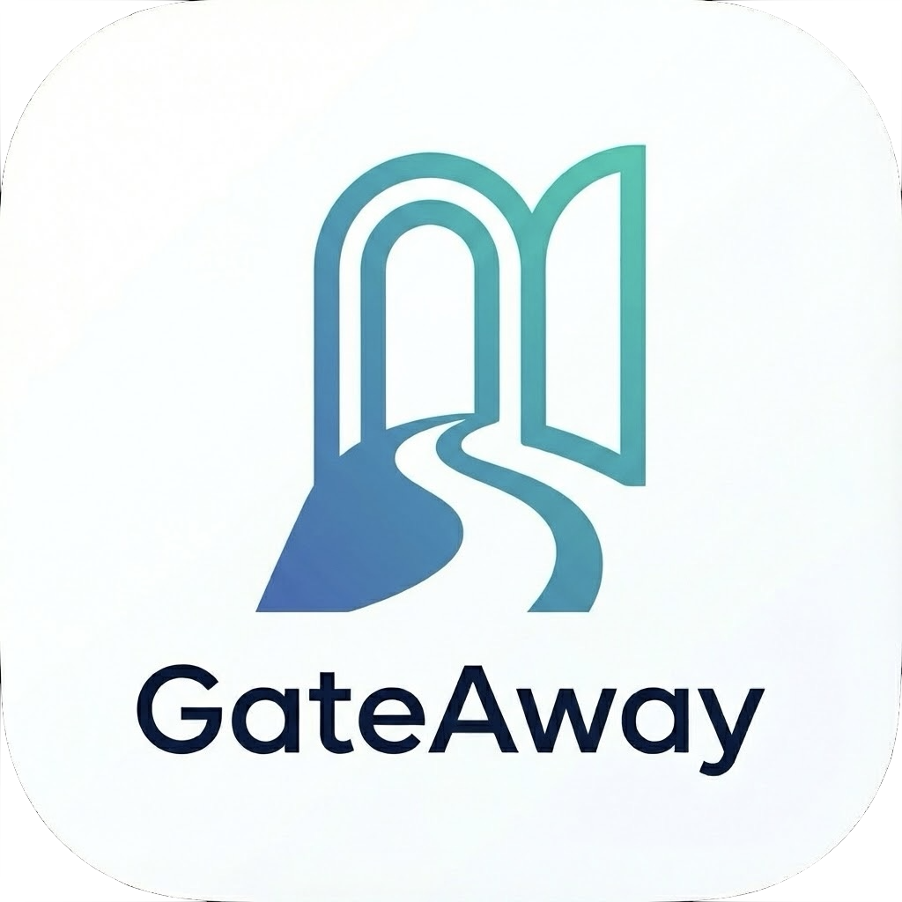

# GateAway - macOS Menu Bar VPN Client

<p align="center">
  
</p>

<p align="center">
A native and lightweight macOS menu bar application for connecting to <a href="https://www.vpngate.net/">VPNGate</a> servers. Simple, fast, and privacy-focused.
</p>

<p align="center">
 
</p>

## Features

- **🚀 One-Click Connect**: Instantly find and connect to the best available server.
- **📡 WiFi-Style Interface**: Managed entirely from your menu bar, just like your WiFi settings.
- **⚡ Smart Selection**: Automatically tests and selects the fastest servers using parallel latency pings.
- **📊 Real-time Stats**: Track your download/upload speeds and data usage directly in the app.
- **🛡️ Secure & Private**: Uses standard macOS Keychain for credentials and Touch ID for effortless authentication. No tracking. No logs.
- **🔧 Zero Configuration**: Automatically manages and installs necessary VPN binaries on first run.

---

## Requirements

- **macOS 11.0 (Big Sur)** or newer.
- No manual setup required—the app handles all dependencies and permissions automatically.

---

## Getting Started

### Option 1: Homebrew (Recommended)
```bash
brew tap realdavian/gateaway https://github.com/realdavian/GateAway
brew install --cask gateaway
```

### Option 2: Manual Download
1. Download the latest `.dmg` from the [Releases](https://github.com/realdavian/GateAway/releases) page.
2. Open the DMG and drag the app to **Applications**.
3. **Right-click** the app → **Open** (required for unsigned apps).
4. Click **Open** again in the warning dialog.

### Option 3: Build from Source
```bash
git clone https://github.com/realdavian/GateAway.git
cd GateAway
open GateAway.xcodeproj
# Press Cmd + R to build and run
```

---

## First Launch: Bypassing macOS Gatekeeper

Since GateAway is not signed with an Apple Developer certificate, macOS will block it on first run.

### If you see "App can't be opened because it is from an unidentified developer":

1. Open **System Settings** → **Privacy & Security**
2. Scroll down to the Security section
3. You'll see a message about GateAway being blocked — click **"Open Anyway"**
4. Enter your password when prompted
5. The app will now launch normally

### Alternative method (Right-click):
1. **Right-click** (or Control-click) on GateAway.app
2. Select **"Open"** from the context menu
3. Click **"Open"** in the warning dialog

> **Note:** You only need to do this once. After the first launch, macOS will remember your choice.

---

## Usage

### Connecting
- **Best by Country**: Click the menu bar icon, go to "Best by Country," and pick a country. The app will find the fastest server for you.
- **Direct Connect**: Browse the "All Servers" list to pick a specific server based on ping, speed, or uptime.

### Settings
- **Touch ID**: Enable this in Settings to replace password prompts with a simple fingerprint tap.
- **Server Refresh**: The app automatically caches server lists, but you can manually refresh them in the menu.

---

## Privacy

GateAway is built with privacy in mind:
- All connection metrics and history stay strictly on your local machine.
- No external tracking, analytics, or third-party servers are involved in your data flow.
- It is a direct interface between your Mac and the public VPNGate network.

> **Server Logging Disclaimer**: GateAway connects to servers provided by volunteers in the [VPNGate](https://www.vpngate.net) network. While this application does not track your activity, individual server operators (volunteers) may keep their own logs. We have no control over the logging policies of these volunteer servers. Always use the service responsibly and in accordance with local laws.

---

## License

MIT License - see [LICENSE](LICENSE) file  
Made with ❤️ for the macOS community
